# merakiBackupAndRestore

This tool allows creating backups of any networks containing the tag `merakiBackup`, and restoring these networks to their backup state by attaching the tag `merakiRestore`.

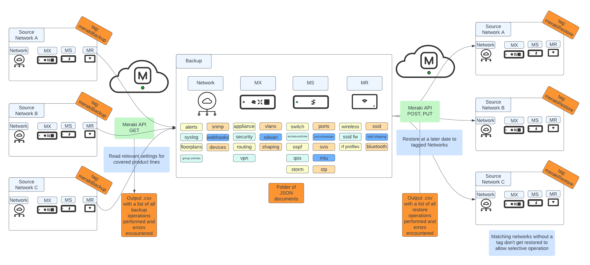

# Table of Contents

* [Introduction](#intro)

* [Prerequisites](#prereq)

* [How to use](#howtouse)

* [Backup Operation](#backup)

* [Restore Operation](#restore)

* [Caveats](#caveats)

* [Supported Settings](#supported_settings)

# Introduction

The Cisco Meraki Dashboard allows organizations to manage large numbers of IT devices distributed across many locations in a simplified manner, centralizing configurations in one point. However, a direct backup and restore tool from the GUI does not exist today. In many cases, it's easy enough to utilize the Organization Changelog to revert a change you made at some point in the past, but undoing a large set of changes can be a difficult proposition.

Luckily, the Cisco Meraki Dashboard is accompanied by a robust set of REST APIs that allow the construction of such backup and restore tools, and merakiBackupAndRestore attempts to fill that gap. This tool allows the creation of backups that are stored locally as a collection of directories with JSON files to represent each set of configurations in your Dashboard, and it also allows restoring a given set of networks to a previous backup stored in the source directory.

## Prerequisites

1. Active Cisco Meraki subscriptions in the orgs where the script will be run
2. API access enabled for these organizations, as well as an API Key with access to them. See how to enable [here](https://documentation.meraki.com/General_Administration/Other_Topics/Cisco_Meraki_Dashboard_API)
3. A working Python 3.0 environment
4. Install libraries in `requirements.txt`
5. Have some deployed organizations and networks with MX, MR and MS devices (MV, MT and MG are not supported right now, they will be ignored during the backup and restore process).

## How to Use

1. Clone repo to your working directory with `git clone https://github.com/Francisco-1088/merakiBackupAndRestore.git`
2. Edit `config.py`
* Add your API Key under `api_key` in line 1
* Define a `backup_tag`, by default it will be `merakiBackup`
* Define a `restore_tag`, by default it will be `merakiRestore`
* Define a `backup_directory`, by default it will be `./backup`
* Optionally, specify EITHER a list of organization IDs under `org_number_filter` in the format `['org_id_1', 'org_id_2', 'org_id_3']` or a string under `org_name_filter` in the format `string` for filtering the organizations you wish to work with (only useful if your API Key has access to many organizations). You can find your Org ID easily by right clicking anywhere in the screen while logged in to your organization, and clicking "View Page Source". In the resulting page use "Find" to look for the keyword `Mkiconf.org_id`

3. Run `pip install -r requirements.txt` from your terminal
4. [Tag networks](https://documentation.meraki.com/General_Administration/Organizations_and_Networks/Organization_Menu/Manage_Tags) you want to work on with the same tag you defined in `config.py` under `backup_tag` and `restore_tag`. `backup_tag` defines the networks within the organization you wish to take backups from. `restore_tag` defines the networks within the organization you wish to restore to a previous backup. If no networks are tagged for a backup operation, if choosing a backup task, the script will end without taking any backups. If choosing a restore task when no networks are tagged for a restore operations, no networks will be restored.

5. Run the script with `python main.py`
6. Depending on the type of job you want to run, continue in the Backup Operation or Restore Operation sections.

## Backup Operation

As you run the script, you will be prompted for a few things:

1. As the script begins running, you will have to choose that you want a `Backup my Meraki networks job` by entering the number `1` at the prompt and pressing Enter
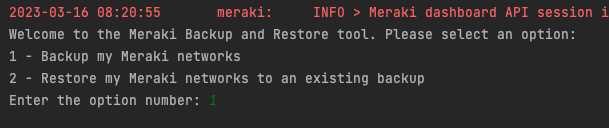
2. You will then be prompted with the list of organizations your API key has access to (after filtering for the optional `org_number_filter` or `org_name_filter` as explained in the previous section), and you will have to enter the row number of the organization you wish to work with. For example, for the `Francisco Tello` organization, you should enter `3` as in the image.
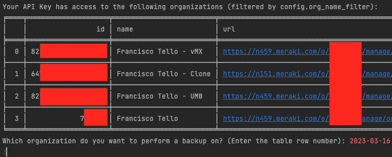
3. The script will then list all networks in that organization that have the `merakiBackup` tag that you assigned in step 4 of the previous section, and you'll have to confirm with a `Y` if you want to proceed with those
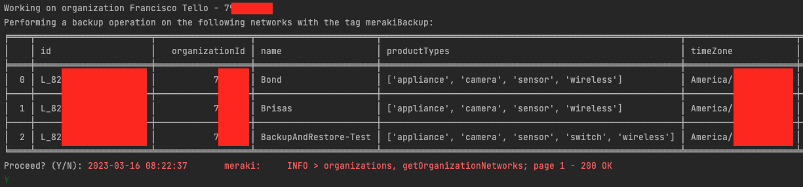
4. As the script runs, several logs will be displayed to the console detailing which step the script is at, and the result of the API calls being performed. Any API-related errors will be caught and logged to a .csv file. Other types of errors might require some additional troubleshooting.
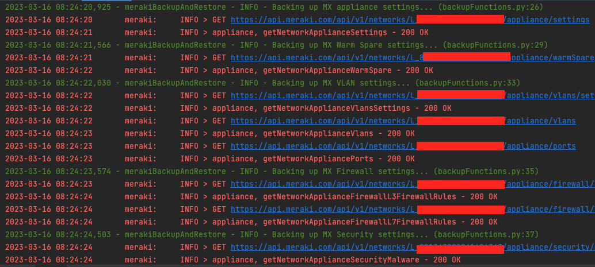
5. The backup script will start creating a folder structure for every setting it fetches as in the picture below, and each setting is saved as a .json file in the structure. As a sample, see the sample .json file for VLAN DHCP settings on an MX below.
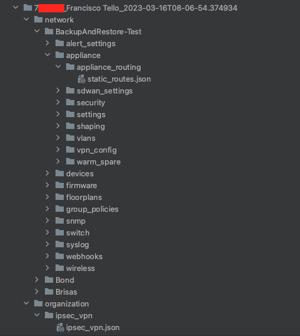
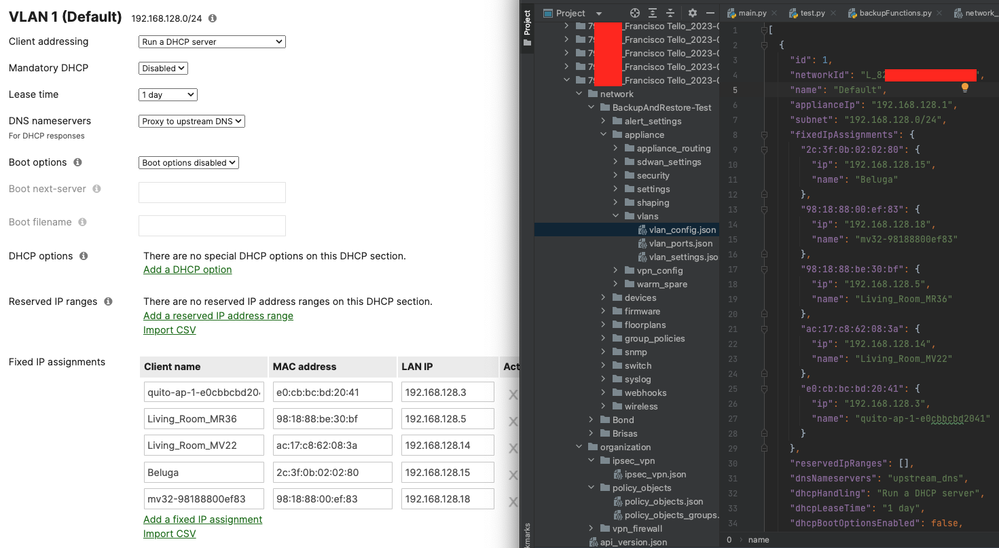
**Note**: It's very important that you do not manually modify these folders or files, as they could break future restore operations. Be very careful when changing these.
6. When the script finishes execution, it will output a CSV file under the backup's top level folder called `backup_operations.csv`, listing every operation performed in every network, and will mark them Complete if they finished successfully, or it will add an error output if not (only for API related errors).
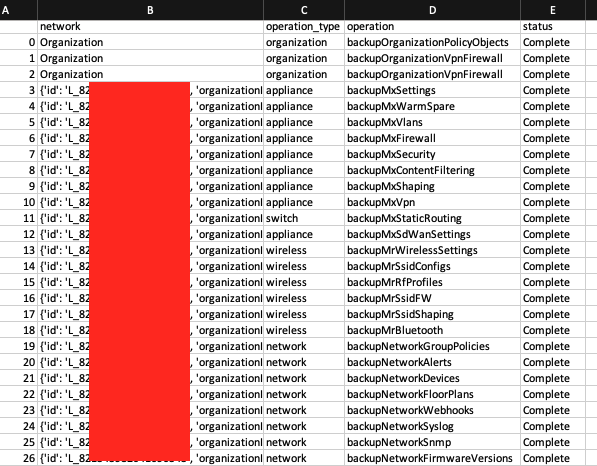

## Restore Operation

As you run the script, you will be prompted for a few things:

1. As the script begins running, you will have to choose that you want a `Restore my Meraki networks job` by entering the number `2` at the prompt and pressing Enter
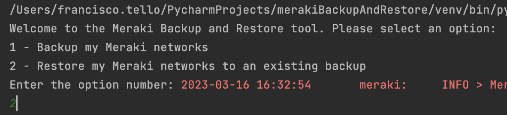
2. You will then be prompted with the list of organizations your API key has access to (after filtering for the optional `org_number_filter` or `org_name_filter` as explained in the previous section), and you will have to enter the row number of the organization you wish to work with. For example, for the `Francisco Tello` organization, you should enter `3` as in the image.

3. The script will then list all networks in that organization that have the `merakiRestore` tag that you assigned in step 4 of the previous section, and you'll have to confirm with a `Y` if you want to proceed with those
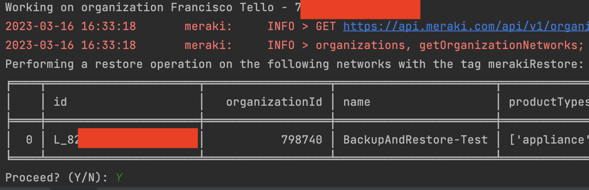
4. You will then be presented with a list of backups in your backup folder that match the selected organization, and you will have to enter the number associated with the backup you want to use
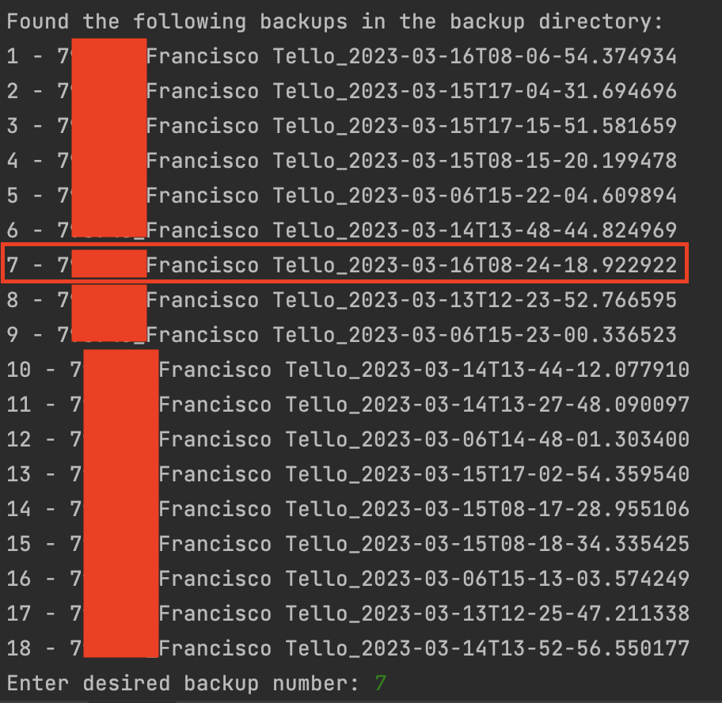
5. The script will then check that the selected backup has backups for the networks tagged with `merakiRestore`, and will list those networks for you. If you agree, enter `Y` at the prompt
6. You may be prompted if there is a firmware mismatch between the backup and target network, stating that incompatibilities may occur when restoring from a previous version of firmware. This can cause the restore operation to fail unexpectedly, so it's a good idea to take backups often. If you're OK with this, select `Y`.
7. The script will start restoring, and will be displaying log messages every step of the way. Sometimes, it may list errors in the restore operation if there is an incompatibility, or issue encountered with an API call.
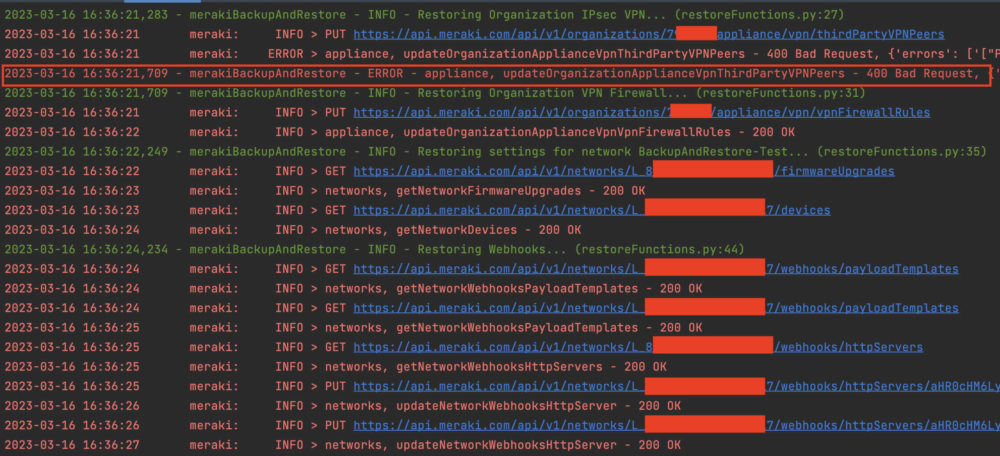
8. When restoring Switch Access Policies, if you're using an external RADIUS server for authentication or accounting, you will be prompted to enter that RADIUS server's secret.
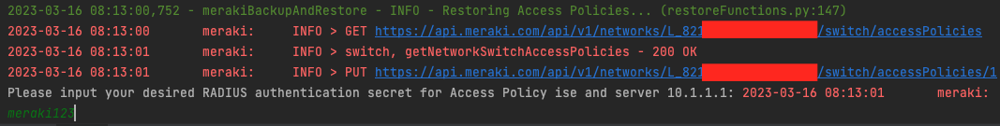
9. When restoring Link Aggregation groups, the script will first delete all existing LAGs, and recreate them as specified by the backup file. This can introduce downtime, so enter `N` if you want to skip this tep, or `Y` if you're OK with proceeding.
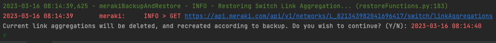
10. When restoring SSIDs, if your SSID uses RADIUS authentication or accounting, you will be prompted for those RADIUS secrets as well.
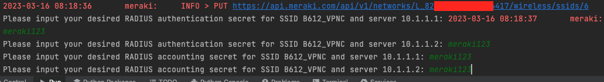
11. As the script finishes execution, it will output a CSV file called `restore_operations.csv` that will list all of the operations performed per network, as well as any errors that happened along the way.
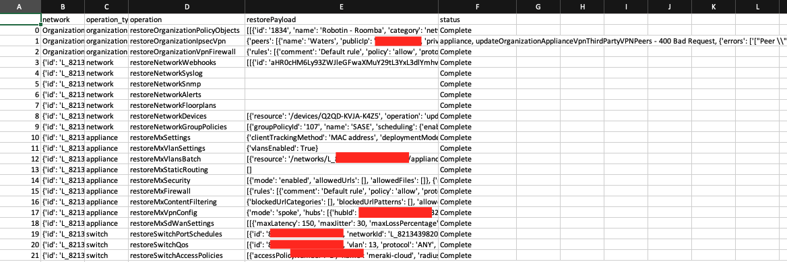

## Caveats

1. Restore operations do not account for RMAs and changes in hardware. If a serial number does not exist in the backup, the settings for this device will not be restored. This can cause Link aggregation and STP settings restores to fail.
2. The restore operation can take a while to complete for a large network, which is why it should be used during a maintenance window to avoid unplanned downtime.
3. The script only backs up and restore MX, MS and MR settings, as well as some Network and Organization level settings. For a list of supported settings check the Supported Settings section. No support for MV, MT or MG exists today, so those devices will be ignored during a backup or restore.
4. When a backup is taken, the firmware version of the network is recorded. As this backup is restored, if the target network does not match the backup's firmware, you will be prompted to continue or not. Firmware version changes between backups can introduce new settings in the API that could cause a restore job to fail unexpectedly, so use with care.
5. Updates to Meraki's API may break this tool until updated, as the required fields in the endpoints may change, so watch out for those as well.

## Supported settings

**Organization-level:**

* Policy Objects (no support for Adaptive Policy objects)
* IPsec VPN (Non-Meraki)
* VPN Firewall

**Network-level:**

* Webhooks
* Syslog
* SNMP
* Alerts
* Floorplans
* Devices
* Group Policies

**Appliance (MX):**

* MX Appliance Network Settings
* VLAN Settings
* Static Routing
* AMP and IPS
* L3 and L7 Firewall
* Content Filtering
* AutoVPN Settings
* SD-WAN Settings
* Traffic Shaping settings
* BGP settings

**Switch (MS):**

* Port Schedules
* QoS
* Access Policies
* Port settings (No support for Adaptive Policy)
* Switch ACL
* DHCP Security
* DSCP to CoS Mappings
* Storm Control
* MTU
* Link Aggregations
* OSPF
* Static Routing
* SVIs
* Switch Network Settings

**Wireless (MR):**

* SSID Configs
* SSID Firewall
* SSID Shaping
* RF Profiles
* Bluetooth Settings
* Wireless Network Settings
