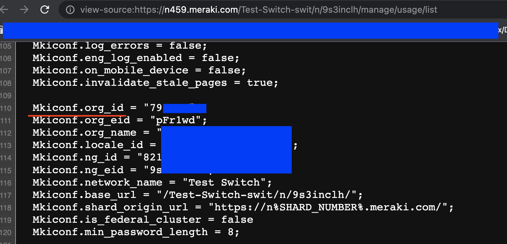
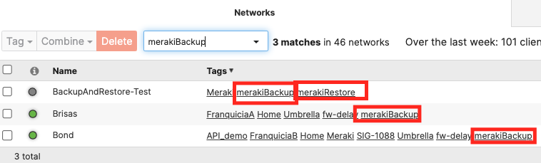

# merakiBackupAndRestore

This tool allows creating backups of any networks containing the tag `merakiBackup`, and restoring these networks to their backup state by attaching the tag `merakiRestore`.

# Table of Contents

[Introduction](#intro)

[Prerequisites](#prereq)

[How to use](#howtouse)

[Backup Operation](#backup)

[Restore Operation](#restore)

[Caveats](#caveats)

# Introduction

The Cisco Meraki Dashboards allows organizations to manage large numbers of IT devices distributed across many locations in a simplified manner, centralizing configurations in one point. However, a direct backup and restore tool from the GUI does not exist today. In many cases, it's easy enough to utilize the Organization Changelog to revert a change you made at some point in the past, but undoing a large set of changes can be a difficult proposition.

Luckily, the Cisco Meraki Dashboard is accompanied by a robust set of REST APIs that allow the construction of such backup and restore tools, and merakiBackupAndRestore attempts to fill that gap. This tool allows the creation of backups that are stored locally as a collection of directories with JSON files to represent each set of configurations in your Dashboard, and it also allows restoring a given set of networks to a previous backup stored in the source directory.

## Prerequisites

1. Active Cisco Meraki subscriptions in the orgs where the script will be run
2. API access enabled for these organizations, as well as an API Key with access to them. See how to enable [here](https://documentation.meraki.com/General_Administration/Other_Topics/Cisco_Meraki_Dashboard_API)
3. A working Python 3.0 environment
4. Install libraries in `requirements.txt`
5. Have some deployed organizations and networks with MX, MR and MS devices (MV, MT and MG are not supported right now, they will be ignored during the backup and restore process).

## How to Use

1. Clone repo to your working directory with `git clone https://github.com/Francisco-1088/merakiBackupAndRestore.git`
2. Edit `config.py`
* Add your API Key under `api_key` in line 1
* Define a `backup_tag`, by default it will be `merakiBackup`
* Define a `restore_tag`, by default it will be `merakiRestore`
* Define a `backup_directory`, by default it will be `./backup`
* Optionally, specify EITHER a list of organization IDs under `org_number_filter` in the format `['org_id_1', 'org_id_2', 'org_id_3']` or a string under `org_name_filter` in the format `string` for filtering the organizations you wish to work with (only useful if your API Key has access to many organizations). You can find your Org ID easily by right clicking anywhere in the screen while logged in to your organization, and clicking "View Page Source". In the resulting page use "Find" to look for the keyword `Mkiconf.org_id`

3. Run `pip install -r requirements.txt` from your terminal
4. [Tag networks](https://documentation.meraki.com/General_Administration/Organizations_and_Networks/Organization_Menu/Manage_Tags) you want to work on with the same tag you defined in `config.py` under `backup_tag` and `restore_tag`. `backup_tag` defines the networks within the organization you wish to take backups from. `restore_tag` defines the networks within the organization you wish to restore to a previous backup. If no networks are tagged for a backup operation, if choosing a backup task, the script will end without taking any backups. If choosing a restore task when no networks are tagged for a restore operations, no networks will be restored.

5. Run the script with `python main.py`

## Backup Operation

## Restore Operation

## Caveats
